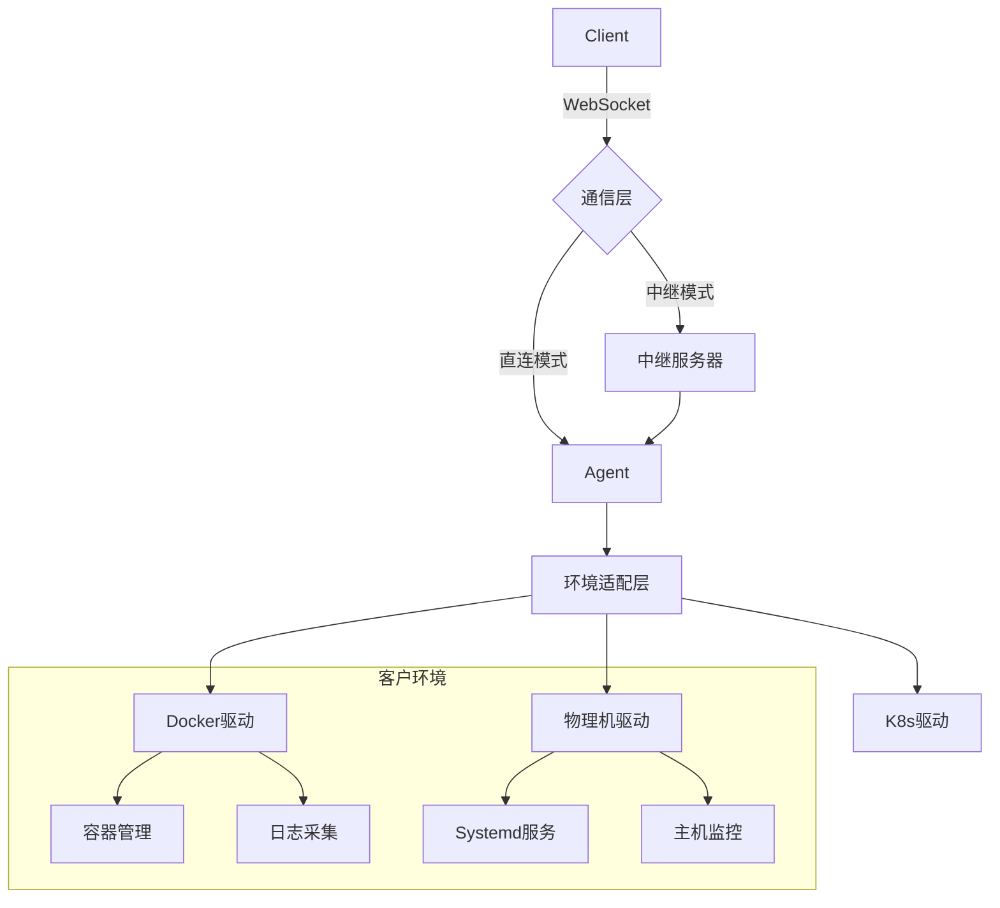
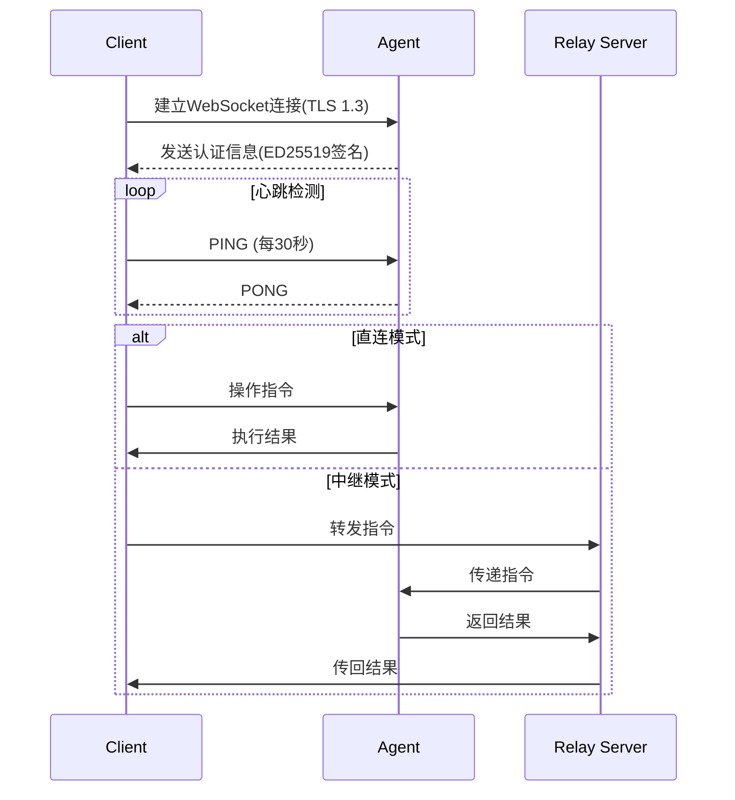
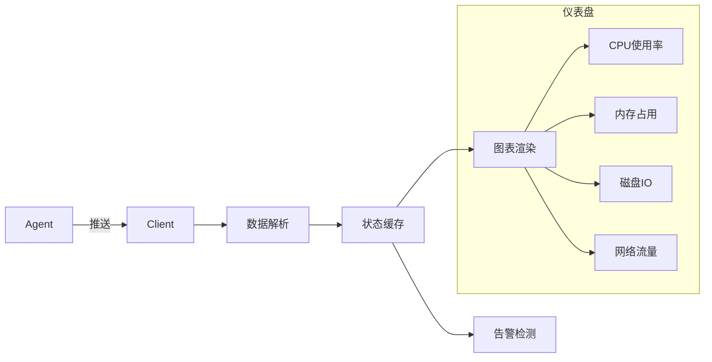
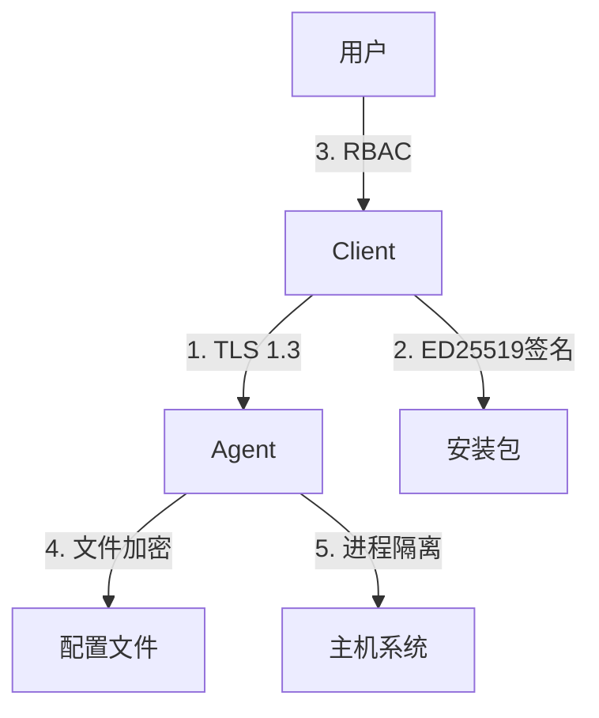
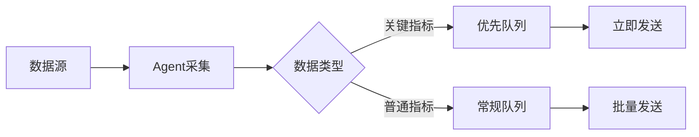

# LightGuide 系统设计说明文档

## 1. 系统概述

LightGuide 是一个跨平台的运维管理工具，采用 Client-Agent 架构设计，用于简化多环境运维流程并提高客户满意度。系统通过统一的界面管理物理机、Docker 和 Kubernetes 环境，提供监控、应用管理、日志分析等核心功能。

### 1.1 设计目标
- 提供统一的多环境管理界面
- 简化运维操作流程
- 实时监控客户环境状态
- 支持安全的端到端通信
- 跨平台支持（Linux 为主）

### 1.2 系统组件
| 组件       | 技术栈                | 主要职责                          |
|------------|-----------------------|----------------------------------|
| Client     | Rust + Tauri 2.0      | 提供用户界面和操作控制            |
| Agent      | Rust (二进制程序)     | 在客户环境执行操作并返回数据      |
| 中继服务器 | Rust (可选组件)       | 穿透 NAT/防火墙的通信中转         |

## 2. 架构设计

### 2.1 整体架构


### 2.2 通信架构


## 3. Client 端详细设计

### 3.1 技术栈
- **核心框架**: Tauri 2.0
- **UI 框架**: Vue3 + Tailwind CSS
- **状态管理**: Pinia
- **持久化存储**: SQLite (加密)
- **通信协议**: WebSocket + Protobuf

### 3.2 模块结构
```rust
src/
├── main.rs              // Tauri入口
├── state.rs             // 全局状态管理
├── api/
│   ├── environment.rs   // 环境管理
│   ├── application.rs   // 应用管理
│   ├── logviewer.rs     // 日志管理
│   ├── config.rs        // 配置管理
│   └── package.rs       // 安装包管理
├── ui/
│   ├── components       // UI组件
│   ├── views            // 页面视图
│   └── store            // 前端状态
├── core/
│   ├── comms.rs         // 通信模块
│   ├── crypto.rs        // 加密模块
│   └── scheduler.rs     // 任务调度
└── persistence/
    ├── db.rs            // 数据库访问
    └── credentials.rs   // 凭证管理
```

### 3.3 核心功能实现

#### 3.3.1 环境管理
```rust
// 环境结构定义
#[derive(Serialize, Deserialize, Clone)]
pub struct Environment {
    pub id: Uuid,
    pub name: String,
    pub env_type: EnvType, // Physical, Docker, Kubernetes
    pub address: String,
    pub created_at: DateTime<Utc>,
    pub last_seen: DateTime<Utc>,
    pub status: EnvStatus,
}

// 环境操作
impl EnvironmentManager {
    pub async fn create(&self, env: NewEnvironment) -> Result<Uuid> {
        // 1. 验证凭证
        // 2. 通过SSH部署Agent
        // 3. 建立WebSocket连接
        // 4. 持久化环境信息
    }
    
    pub async fn delete(&self, env_id: Uuid) -> Result<()> {
        // 1. 发送卸载指令
        // 2. 关闭连接
        // 3. 清理本地数据
    }
}
```

#### 3.3.2 实时仪表盘


## 4. Agent 端详细设计

### 4.1 技术栈
- **语言**: Rust (无运行时依赖)
- **通信**: Tokio + WebSocket
- **包管理**: Cargo
- **构建目标**: x86_64-unknown-linux-musl

### 4.2 模块结构
```rust
src/
├── main.rs              // 入口点
├── comms/
│   ├── websocket.rs     // WebSocket服务
│   └── protocol.rs      // 消息协议
├── environment/
│   ├── mod.rs           // 环境抽象
│   ├── physical.rs      // 物理机实现
│   ├── docker.rs        // Docker实现
│   └── k8s.rs           // Kubernetes实现
├── services/
│   ├── monitoring.rs    // 监控服务
│   ├── application.rs   // 应用管理
│   ├── logging.rs       // 日志服务
│   └── package.rs       // 包管理
├── security/
│   ├── crypto.rs        // 加密操作
│   └── auth.rs          // 认证模块
└── system/
    ├── service.rs       // 服务管理
    └── filewatch.rs     // 文件监控
```

### 4.3 核心功能实现

#### 4.3.1 应用管理（Docker 环境）
```rust
// Docker应用管理实现
impl DockerEnvironment {
    pub fn list_applications(&self) -> Result<Vec<DockerApp>> {
        let output = Command::new("docker")
            .args(["ps", "--format", "{{.ID}}|{{.Image}}|{{.Status}}|{{.Ports}}"])
            .output()?;
        
        output.stdout
            .lines()
            .map(|line| {
                let parts: Vec<&str> = line.split('|').collect();
                DockerApp {
                    id: parts[0].to_string(),
                    image: parts[1].to_string(),
                    status: parse_status(parts[2]),
                    ports: parse_ports(parts[3]),
                }
            })
            .collect()
    }
    
    pub fn stop_application(&self, app_id: &str) -> Result<()> {
        Command::new("docker")
            .args(["stop", app_id])
            .status()?;
        Ok(())
    }
}
```

#### 4.3.2 日志管理
```rust
// 日志收集器实现
pub struct LogCollector {
    watcher: RecommendedWatcher,
    paths: Vec<PathBuf>,
    sender: Sender<LogEntry>,
}

impl LogCollector {
    pub fn new(config: LogConfig) -> Result<Self> {
        let (sender, receiver) = channel(1000);
        let mut watcher = Watcher::new_immediate(move |res| {
            if let Ok(event) = res {
                handle_event(event, &sender);
            }
        })?;
        
        for path in &config.paths {
            watcher.watch(path, RecursiveMode::Recursive)?;
        }
        
        Ok(Self { watcher, paths: config.paths, sender })
    }
    
    pub fn start_tailing(&self) {
        for path in &self.paths {
            if path.is_file() {
                if let Ok(file) = File::open(path) {
                    let sender = self.sender.clone();
                    thread::spawn(move || {
                        tail_file(file, sender);
                    });
                }
            }
        }
    }
}
```

## 5. 端到端通信设计

### 5.1 通信协议
```protobuf
syntax = "proto3";

message Envelope {
  string message_id = 1;
  oneof payload {
    CommandRequest command = 2;
    CommandResponse response = 3;
    EventNotification event = 4;
    DataStream data = 5;
  }
}

message CommandRequest {
  string command = 1;
  map<string, string> parameters = 2;
}

message CommandResponse {
  enum Status {
    SUCCESS = 0;
    FAILED = 1;
    IN_PROGRESS = 2;
  }
  Status status = 1;
  string output = 2;
  string error = 3;
}

message EventNotification {
  string event_type = 1;
  bytes payload = 2; // JSON encoded
}

message DataStream {
  string stream_id = 1;
  bytes chunk = 2;
  bool is_last = 3;
}
```

### 5.2 通信流程示例
```mermaid
sequenceDiagram
    participant C as Client
    participant A as Agent
    
    C->>A: Envelope {
        message_id: "cmd-123",
        payload: CommandRequest {
            command: "app.list",
            parameters: {"type": "docker"}
        }
    }
    
    A->>A: 执行docker ps命令
    A->>A: 解析输出结果
    
    A->>C: Envelope {
        message_id: "cmd-123",
        payload: CommandResponse {
            status: SUCCESS,
            output: JSON([{id: "a1b2", ...}])
        }
    }
    
    loop 日志流
        A->>C: Envelope {
            message_id: "log-456",
            payload: DataStream {
                stream_id: "logs-app-789",
                chunk: "2023-10-01 INFO Starting...",
                is_last: false
            }
        }
    end
```

## 6. 安全设计

### 6.1 安全架构


### 6.2 ED25519 签名实现
```rust
// 安装包验证实现
pub fn verify_package(package_path: &Path, public_key: &[u8]) -> Result<bool> {
    let mut file = File::open(package_path)?;
    let mut hasher = Sha256::new();
    io::copy(&mut file, &mut hasher)?;
    let hash = hasher.finalize();
    
    let signature = extract_signature(package_path)?;
    let public_key = VerifyingKey::from_bytes(public_key)?;
    
    public_key.verify(&hash, &signature)?;
    Ok(true)
}

// 密钥生成示例
pub fn generate_keypair() -> (SigningKey, VerifyingKey) {
    let mut csprng = OsRng;
    let signing_key = SigningKey::generate(&mut csprng);
    let verifying_key = signing_key.verifying_key();
    (signing_key, verifying_key)
}
```

### 6.3 访问控制模型
```rust
// 权限检查实现
pub fn check_permission(user: &User, action: Action, resource: Resource) -> bool {
    match user.role {
        Role::Admin => true,
        Role::Operator => match action {
            Action::DeleteEnvironment => false,
            _ => true,
        },
        Role::Viewer => match action {
            Action::ViewMetrics | Action::ViewLogs => true,
            _ => false,
        },
    }
}
```

## 7. 部署与运维

### 7.1 系统要求
| 组件       | CPU    | 内存   | 存储     | 网络            |
|------------|--------|--------|----------|-----------------|
| Client     | 1核+   | 512MB+ | 100MB    | 宽带连接        |
| Agent      | 0.5核+ | 50MB   | 50MB     | 持续连接        |
| 中继服务器 | 2核    | 1GB    | 1GB+日志 | 公网IP，5Mbps+ |

### 7.2 Agent 部署脚本示例
```bash
#!/bin/bash
# agent-install.sh

VERSION="1.0.0"
TEMP_DIR=$(mktemp -d)
AGENT_URL="https://download.lightguide.io/agent-$VERSION-x86_64-unknown-linux-musl"

# 下载并验证Agent
curl -sSL $AGENT_URL -o $TEMP_DIR/lightguide-agent
curl -sSL "$AGENT_URL.sig" -o $TEMP_DIR/lightguide-agent.sig

if ! openssl dgst -sha256 -verify /etc/lightguide/pubkey.pem \
    -signature $TEMP_DIR/lightguide-agent.sig \
    $TEMP_DIR/lightguide-agent; then
    echo "签名验证失败!"
    exit 1
fi

# 安装Agent
install -m 755 $TEMP_DIR/lightguide-agent /usr/local/bin/lightguide-agent

# 创建Systemd服务
cat > /etc/systemd/system/lightguide-agent.service <<EOF
[Unit]
Description=LightGuide Agent
After=network.target

[Service]
Type=notify
ExecStart=/usr/local/bin/lightguide-agent
Restart=on-failure
RestartSec=5s
Environment=LIGHTGUIDE_ENV_TYPE=$ENV_TYPE
Environment=LIGHTGUIDE_CLIENT_ID=$CLIENT_ID

[Install]
WantedBy=multi-user.target
EOF

# 启用并启动服务
systemctl daemon-reload
systemctl enable lightguide-agent
systemctl start lightguide-agent

# 清理
rm -rf $TEMP_DIR
```

## 8. 性能优化策略

### 8.1 资源使用优化
| 组件   | 优化策略                          | 预期效果               |
|--------|----------------------------------|----------------------|
| Client | 增量UI更新(Virtual DOM)           | 减少CPU使用30%        |
|        | WebSocket消息压缩(LZ4)            | 减少带宽40%           |
| Agent  | 监控数据采样(可配置间隔)          | 降低CPU负载50%        |
|        | 日志批处理传输                    | 减少连接数80%         |
|        | 内存池重用                        | 减少GC暂停时间        |

### 8.2 实时性优化


## 9. 扩展性与未来演进

### 9.1 插件架构设计
```rust
// 插件接口定义
pub trait Plugin: Send + Sync {
    fn name(&self) -> &str;
    fn init(&mut self, context: PluginContext) -> Result<()>;
    fn handle_command(&self, cmd: &str, params: &[&str]) -> PluginResult;
    fn shutdown(&self);
}

// 插件加载机制
pub struct PluginManager {
    plugins: HashMap<String, Box<dyn Plugin>>,
}

impl PluginManager {
    pub fn load_plugin(&mut self, path: &Path) -> Result<()> {
        let lib = Library::new(path)?;
        let symbol: Symbol<fn() -> Box<dyn Plugin>> = unsafe {
            lib.get(b"create_plugin")
        }?;
        
        let plugin = symbol();
        self.plugins.insert(plugin.name().to_string(), plugin);
        Ok(())
    }
}
```

### 9.2 演进路线
1. **V1.0**: Docker 环境支持 + 基础监控
2. **V1.5**: 物理机环境支持 + Systemd 集成
3. **V2.0**: Kubernetes 环境支持
4. **V2.5**: 多租户支持 + 审计日志
5. **V3.0**: AI 辅助运维 + 预测性维护

## 10. 附录

### 10.1 关键数据结构
```rust
// 应用状态表示
pub enum ApplicationStatus {
    Running,
    Stopped,
    Restarting,
    Degraded,
    Unknown,
}

// 监控数据结构
#[derive(Serialize, Deserialize)]
pub struct SystemMetrics {
    pub timestamp: DateTime<Utc>,
    pub cpu_usage: f32,         // 百分比
    pub memory_used: u64,        // 字节
    pub memory_total: u64,       // 字节
    pub disk_io: DiskIOStats,
    pub network: NetworkStats,
}

#[derive(Serialize, Deserialize)]
pub struct DiskIOStats {
    pub read_bytes: u64,
    pub write_bytes: u64,
    pub read_ops: u32,
    pub write_ops: u32,
}
```

### 10.2 性能指标参考

| 操作类型          | 预期延迟 (LAN) | 预期延迟 (WAN) | 资源消耗      |
|-------------------|----------------|----------------|---------------|
| 环境连接建立      | < 500ms        | < 2000ms       | 低            |
| 监控数据获取      | < 100ms        | < 500ms        | 中            |
| 应用列表查询      | < 300ms        | < 1000ms       | 低            |
| 日志检索 (1MB)    | < 800ms        | < 1500ms       | 高 (CPU)      |
| 安装包传输 (10MB) | < 2000ms       | < 10000ms      | 高 (网络)     |
| 配置文件同步      | < 100ms        | < 300ms        | 低            |

本设计文档详细说明了 LightGuide 系统的架构、实现和关键设计决策，为后续开发提供了全面的技术指导。